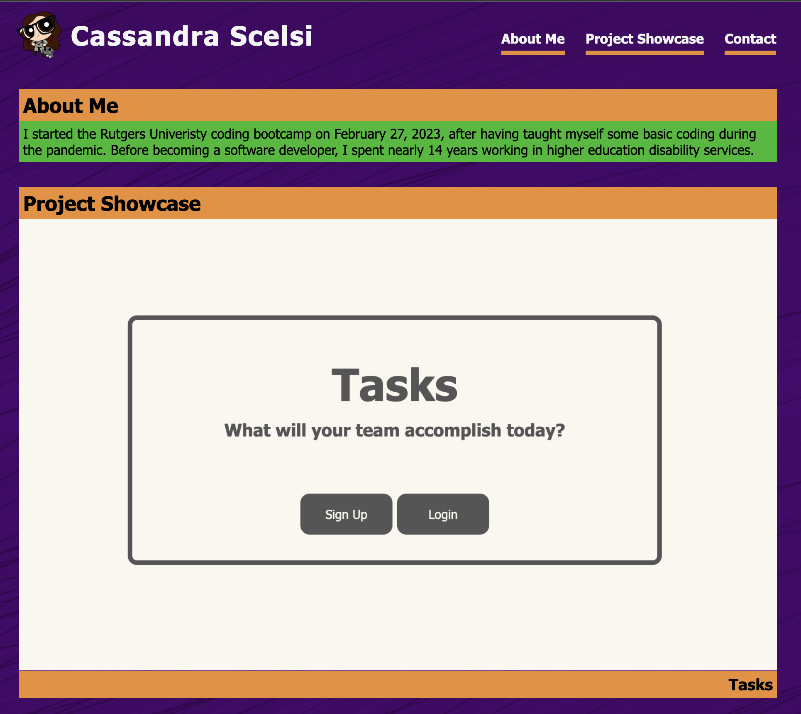

# Cassandra Scelsi's Professional Portfolio 

## Description 

A professional portfolio is an opportunity to showcase my projects to potential employers as one tool to help them evaluate if I possess the skills they are seeking in an employee.  Because I do not have projects to display yet, the portfolio has been built using placeholder text and images.  This portfolio has been a challenge learing to use flexboxes.

## Installation

N/A

## Usage

Use the navigation bar to navigate the page.

## Credits

- Chung, W., & Daniel, N. (2023, February 7). 25 Web Developer Portfolio Examples from Top Developers. Hostinger. Retrieved March 2, 2023, from https://www.hostinger.com/tutorials/web-developer-portfolio 
- (n.d.). 2.7 million+ Stunning Free Images to Use Anywhere - Pixabay - Pixabay. Retrieved March 2, 2023, from https://pixabay.com.
- (n.d.). HTML Color Codes. Retrieved March 2, 2023, from https://htmlcolorcodes.com
- Palette / Yukatas. (2011, May 8). COLOURlovers. Retrieved March 2, 2023, from https://www.colourlovers.com/palette/1568078/Yukatas
- HTML img tag. (n.d.). W3Schools. Retrieved March 2, 2023, from https://www.w3schools.com/tags/tag_img.asp
- practice-portfolio (2023, February 24). Retrieved March 2, 2034 from Macintosh HD / Users / CASSANDRA / bootcamp / practice / practice-portfolio
- CSS letter-spacing property. (n.d.). W3Schools. Retrieved March 2, 2023, from https://www.w3schools.com/cssref/pr_text_letter-spacing.php
- Learn About Responsive Images: CSS styling for Responsive Websites. (2019, October 1). BitDegree. Retrieved March 3, 2023, from https://www.bitdegree.org/learn/responsive-image
- HTML a tag. (n.d.). W3Schools. Retrieved March 5, 2023, from https://www.w3schools.com/tags/tag_a.asp
- Coyier, C. (2013, May 14). Open Link in a New Window | CSS-Tricks. CSS-Tricks. Retrieved March 5, 2023, from https://css-tricks.com/snippets/html/open-link-in-a-new-window/ 
- CSS Styling Links. (n.d.). W3Schools. Retrieved March 5, 2023, from https://www.w3schools.com/css/css_link.asp
- Mineo, G. (2022, July 27). How to Create a Link to Jump to a Specific Part of a Page [Quick Tip]. HubSpot Blog. Retrieved February 28, 2023, from https://blog.hubspot.com/marketing/jump-link-same-page
- HTML Image Link. (n.d.). HTML.am. Retrieved March 6, 2023, from https://www.html.am/html-codes/links/html-image-link.cfm
- How To Center a Website. (n.d.). W3Schools. Retrieved March 6, 2023, from https://www.w3schools.com/howto/howto_css_center_website.asp
- (n.d.). GitLab. Retrieved March 3, 2023, from https://git.bootcampcontent.com/Rutgers-University/RUT-VIRT-FSF-FT-02-2023-U-LOLC 
- Github. Retrieved March 7, 2023, from https://github.com/scelsic2/horiseon-seo-accessibility/blob/main/README.md?plain=1

## License

MIT License.

## Deployed Application Link

https://scelsic2.github.io/professional-portfolio/ 
